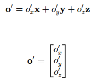

# Robotics-Modelling-and-Control

## Kinematics
- **Forward Kinematics (FK)** - Computing an end-effector pose from joint angles, visualising reachable workspace, and implementing an efficient single-pass FK algorithm for arbitrary chains.
- **Differential Kinematics** - Deriving the Jacobian matirix, interpreting its geometric meaning, plotting the manipulability ellipse, and detecting singularities via rank/condition tests.
- **Inverse Kinematics (IK)** - Solving the pose-to-joint problem through both analytic and numerical techniques.

## Position of a Rigid Body
A rigid body is completely described in space by its position and orientation with respect to a reference frame.  

- **Reference Frame: F = O-xyz**  
Origin: O
Unit vectors: x, y, z(along each coordinate axis)  
Suppose there is a fixed point O' on the rigid body. Its position with respect to the frame F is given by a position vector $\mathbf{o}' \in \mathbb{R}^3$.  

- **Representation of the Position Vector**  
The vector o' can be expressed as  

- **What is a Bound Vector ?**  
A bound vector is a vector that not only has magnitude and direction, but also a fixed point of application and acts a specific line in space.

## Orientation of a Rigid Body

## Rotation Matrix

## Workspace visualisation (planar 2‑R)

## Single‑Pass FK Algorithm implementation

## Jacobian properties: rank, manipulability, ellipse

## Error Propagation Ellipse  
Measurements or commands in joint space are never perfect. If the joint vector q carries uncertainty, that error propagates through the robot's kinematics and affects the position of the end effector in task space.  

[error_propagation_ellipse.py](https://github.com/knamatame0729/Robotics-Modelling-and-Control/blob/main/error_propagation_ellipse.py)  

- Result  (Joint angle uncertainty 0.05 [rad])  
