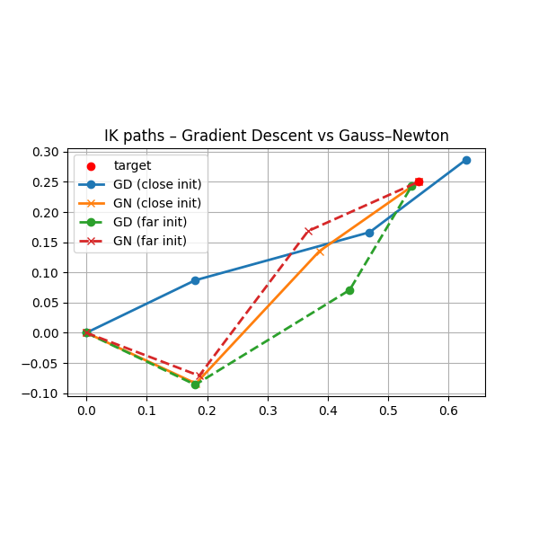

# Robotics-Modelling-and-Control 

## Position of Rigid Body
[position_vector_3d.py](https://github.com/knamatame0729/Robotics-Modelling-and-Control/blob/main/position_vector_3d.py)
- **Reference Frame: F = O-xyz**  
Origin: O
Unit vectors: x, y, z(along each coordinate axis)  
Suppose there is a fixed point O' on the rigid body. Its position with respect to the frame F is given by a position vector $\mathbf{o}' \in \mathbb{R}^3$.  

- **Representation of the Position Vector**  
The vector o' can be expressed as  
 

- **What is a Bound Vector ?**  
A bound vector is a vector that not only has magnitude and direction, but also a fixed point of application and acts a specific line in space.

## Orientation of a Rigid Body
[rigid_body_orientation.py](https://github.com/knamatame0729/Robotics-Modelling-and-Control/blob/main/rigid_body_orientation.py)  

The orientation of a rigid body is described by attaching a new orthonormal frame  O′-x′y′z′  to the body and expressing its axes with respect to the reference frame  O-xyz .

Each unit vector  x′,y′,z′  of the body frame is expressed in terms of the reference frame as:  

## Rotation Matrix
[rotation_matrix.py](https://github.com/knamatame0729/Robotics-Modelling-and-Control/blob/main/rotation_matrix.py)  

A rotation matrix provides a way to describe the orientation of a rigid body in three-dimensional space.
It is formed by arranging the unit vectors of the rotated coordinate frame into a 3×3 matrix R  

Rotations in 3D space can be described using elementary rotation matrices, each representing a rotation about one of the main coordinate axes of a fixed reference fram O-xyz. A rotation is considered positive if it is counter-clockwise when viewed along the direction of the axis.  

- A rotation about teh x-axis by angle γ keeps the x-axis fixed and rotates the y- and z-aixs.  

- A rotation about the y-axis by angle β fixes the y-axis, rotating teh x- and z-axis.  

- A rotation about the z-axis by angle α fixes the z-axis, rotating the x- and y-axis in the xy-plane.  
 

### Representation of a Vector
Let **p** be a vector expressed in the reference frame. When we apply a rotation matrix R** to **p**, the result is a new vector *R***p**, which is the rotated version of **p**:  

**p'** = *R***p**
  

### Composition of Rotation Matrices
[compose_rotation_matrices.py](https://github.com/knamatame0729/Robotics-Modelling-and-Control/blob/main/compose_rotation_matrices.py)

Let O-x₀y₀z₀, O-x₁y₁z₁, O-x₂y₂z₂ be three frames with common origin O.  

Let **p₂** be the coordinates of a vector **p** in Frame 2. Then, the transformations between frames are given by:

**p₁** = R12 **p₂**  
**p₀** = R01 **p₁**  

By substituting,

**p₀** = R01 R12 **p₂**  
**p₀** = R02 **p₂**

 

- If each rotation is defined with respect to the current(rotating) frame, apply them using post-multiplication in the other they occur:  

*R(final)* = *R₁R₂R₃ ...*

- If each rotation is defined with respect to a fixed(initial) frame, apply them using pre-multiplication in reverse order: 

*R(final)* = *Rₙ ... R₂R₁*

 

## Kinematics
- **Forward Kinematics (FK)** - Computing an end-effector pose from joint angles, visualising reachable workspace, and implementing an efficient single-pass FK algorithm for arbitrary chains.
- **Differential Kinematics** - Deriving the Jacobian matirix, interpreting its geometric meaning, plotting the manipulability ellipse, and detecting singularities via rank/condition tests.
- **Inverse Kinematics (IK)** - Solving the pose-to-joint problem through both analytic and numerical techniques.

## Position of a Rigid Body
A rigid body is completely described in space by its position and orientation with respect to a reference frame. 

## Workspace visualisation (planar 2‑R)

[workspace_visualize.py](https://github.com/knamatame0729/Robotics-Modelling-and-Control/blob/main/workspace_visualize.py)

  

  

  

## Single‑Pass FK Algorithm implementation
[single_pass_fk.py](https://github.com/knamatame0729/Robotics-Modelling-and-Control/blob/main/single_pass_fk.py)

The sigle-pass FK algorithm computes every link's world tranform in one linear sweep - no recursion, no call-stack growth.  

- Efficiency - Linear time, cache-friendly loop.
- Generality - Handles chains, trees, even floating bases (set parent = -1 and provide its pose).
- Simplicity - Mirrors physical assembly: base → tip.

  

## Differential Kinematics
The forward kinematics map  

*f* : *Q* → *SE(3)*, *x = f(q)*

is defferntiable almost everywhere. Linearizing it around a configuration **q** yields the core relation:  

*ẋ = J(q)q̇*

where *J(q)* is the Jacobian matrix.

## Jacobian properties: rank, manipulability, ellipse

### Rank & Singularity
- **Full rank** (rank *J = m*) → mapping is locally bijective, every small task-space motion has a joint-space pre-image.
- **Rank-deficient** → **singularity**: at least one task direction is lost, requiring infinite joint rates or forces.

### Manipulability & Condition Number
- Yoshikawa manipulability

*w(q)* = $\sqrt{\det(J J^\top)}$ = $σ_1$ $σ_2$ ... $σ_m$

measures volume of achievable velocity vectors for unit joint rates. (How freely a robot's end-effector can move at a given configuration)

### Isotropy / conditioning

$$
      \kappa(J)=\frac{\sigma_{\max}}{\sigma_{\min}},\quad 1\le\kappa<\infty.
$$

Lower $\kappa$ implies more isotoropic response (uniform dexterity); $\kappa \to \infty$ at singularities.

## Error Propagation Ellipse  
Measurements or commands in joint space are never perfect. If the joint vector q carries uncertainty, that error propagates through the robot's kinematics and affects the position of the end effector in task space.  

[error_propagation_ellipse.py](https://github.com/knamatame0729/Robotics-Modelling-and-Control/blob/main/error_propagation_ellipse.py)  

- Result  (Joint angle uncertainty 0.05 [rad])  

## Inverse Kinematics

## Optimisation-Based IK - Gradient Descent & Gauss-Newton

[gradient_vs_gaussnewton_ik.py](https://github.com/knamatame0729/Robotics-Modelling-and-Control/blob/main/gradient_vs_gaussnewton_ik.py)  

- ### **Gradient Descent**  

**Props**: Trival to implement, only requires the gradient (or Jacobian).  
**Cons**: Slow convergence, sensitive to step size, stalls near singularities.  

- ### **Gauss-Newton (Jacobian Pseudo-Inverse)**  

**Pros** : Quadratic-like convergence near a solution; steps computed via Jacobian pseudo-inverse.  
**Cons** : May diverge if the initial guess is poor; requires Jacobian; ill-conditioned at singularities.  

## Sensitivity of EOM to Payload Mass & Force Direction

[planar_3R_static_torque.py](https://github.com/knamatame0729/Robotics-Modelling-and-Control/blob/main/planar_3R_static_torque.py)

**System**
Planar 3-link R-R-R arm (each link 1m) + point-mass payload at the tip

**Interact**
- Payload mass slider *m* (kg)
- Force magnitude slider *F* (N)
- Force direction slider *θ*

**Output**
- Numeric *M(q)* and *G(q)* for a sample pose
- External wrench mapped to joint torqes $\tau_{\text{ext}} = J^\top F$  
- Torques $\tau_1,\tau_2,\tau_3$

## RNEA (Recursive Newton-Euler Algorithm)

#### Overview
RNEA is a **inverse dynamics** algorithm.  
It computes the requred joint torques/forces given the joint positions, velocities, and accelerations.

#### Key Features
- Based on Newton-Euler equations of motion
- Uses a **recursive** formulation for computational efficiency
- Fast - Suitable for real-time control and simulation

#### Computational Steps
1. **Forward Recursion**
Propagate link velocities and accelerations from base to end-effector
2. **Backward Recursion**
Compute forces and joint torques from end-effector back to base

$$\tau_N = \text{RENA}(q, \dot q, \ddot q)$$

#### Computational Scalability
RNEA ≈ $\mathcal O(n)$
## Lagrangian

#### Symbolic Lagrange
Derive $M(q)$, $C(q, \dot q)$, and $G(q)$ and Compute  

$$\tau_L = M(q)\,\ddot q + C(q,\dot q)\, \dot q + G(q)$$

##### Computational Scalability 
Lagrange ≈ $\mathcal O(n^3)$
